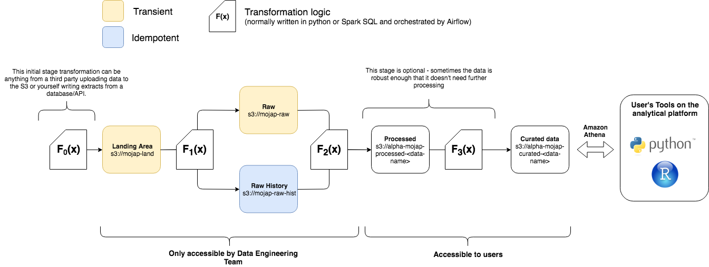

# MoJ Data Engineering Guidance

An example on how to build a data ETL pipeline in the data engineering team within MoJ on the Analytical Platform with some notes about best practices.

## Data Engineering Structure



The image above lays out the processing structure. We are going to go through an overview of why we try to adhere to this structure and will try to use the problem set above to explain how we are going to apply this structure to the problem set.

The first thing to note is our tech stack. We use S3 for data storage, our transformation logic to move data from A to B is not restricted to but normally carried out in Python or Spark (SQL). These scripts are versioned on GitHub and ran as Dockerised containers on our Kubernetes Cluster. The orestration of these tasks to run our full pipeline is managed by Airflow.

### Landing Area

All the data that we process is always written into this landing area first. We either recieve data from others or extract it ourselves and write it to the landing area. Some key notes to this s3 bucket:

- Data is written to this bucket, we have a naming convection for each dataset e.g. `s3://mojap-land/open-data/parliment-questions/`. Who (or what) writes data to that location should have write access to that s3 path only.
- Data in this folder is transient meaning that once it's processed it is deleted from its folder.

### Raw History

When data lands into `s3://mojap-land` we want a script (`F1(x)`) to check the data and make sure that it's expected - this may be something like has the correct extension, does have the expected type of data, expected volumes etc. If the data passes the checks then the data that falls into land should be moved from `s3://mojap-land` to `s3://mojap-raw-hist` (and also `s3://mojap-raw` this is optional will get onto this in a bit). This function should not transform the data it should only check it's validity. We want to ensure that the data in `moj-raw-hist` is an exact replica of what the data was when it landed in `mojap-land`. **This is vital for reproducibility.** Any time data falls into `moj-raw-hist` you should treat that data as immutible block. If you require to make any changes to the data / corrections do that later down the pipeline never change the original raw data. When data is moved from from `land` to `raw-hist` you should partition your data or name it so that you can traceback the date/time it was moved over. Ideally if you have control over how data is uploaded to `mojap-land` in which most cases you do you can upload the data in the following folder structure:

```
└── s3://mojap-land
│   └── my-data-folder
│       └── file_land_timestamp=1534978800
│           └── data_1534978800.csv
```

We use `file_land_timestamp` as a file partition of when the data was uploaded to the land bucket in S3. We use hive partitioning [for more details](https://resources.zaloni.com/blog/partitioning-in-hive) as it allows you to point athena or spark directly at the data folder `my-data-folder/` and treat that as a dataframe with that's partitioned by a column named `file_land_timestamp`. When your function tests and moves data from data from land to raw you should keep the same folder structure only changing the bucket name (making it easy to cut and paste the data from one bucket to another after it passes the testing function). Below is an example of what you `raw-hist` bucket should look like:

```
└── s3://mojap-raw-hist
│   └── my-data-folder/
│       └── file_land_timestamp=1534968800
│           └── data_1534968800.csv
│       └── file_land_timestamp=1534978800
│           └── data_1534978800.csv
```

This structure shows that there have been two dataset loaded from `land` into `raw-hist` at different times. Following the same naming conventions means that it is easy to track your data between each process. It's also worth noting that if possible it is also good practice to suffix your data file itself with the timestamp value. In case someone accidently moves the data it will still give you a change to try and figure out what time it was uploaded into your pipeline.

### Raw

This area is optional. If your data is large you may want to only process/add deltas to your existing database rather creating everything from scratch from `raw-hist`. It is recommended that if the relative computational overheard in recalculating everything from scratch is minor (compared to running a more complex code to update your existing data with a delta) then you should opt for recalculating everything from scratch as this makes your scripts to transform data simpler, idempotent and less dependentant on the state of the current database [see here for an example of this](https://github.com/moj-analytical-services/learning_data_engineering/blob/master/functional_progamming_etl.ipynb) _(unfortunately this repo is only available to those part of the org)_.

:point_up: _note it's out of date so take it with a pinch of salt_.

However if you do need to update your database by deltas or have a preprocess stage (see below) then you might want to utilise the `raw` folder. This should be transient like `land` i.e. once done with the data delete it (as there should be an exact copy in `raw-hist`). Continuing with our example the folder structure should mimic that of `raw-hist`/`land` just with a different bucket name e.g.

```
└── s3://mojap-raw
│   └── my-data-folder
│       └── file_land_timestamp=1534978800
│           └── data_1534978800.csv
```

### Processed

This area is again optional. If you're data in raw is messed up or complex then you may want to add this stage. For example we often recieve corrupted CSVs from external data suppliers where we've had to write our own csv parser to fix the dataset. This is a costly process and we only want to apply this once to the data as it comes in. In most cases you will be taking data from the `raw` folder transforming the data into a more usable dataset and writing it to a `processed` bucket - this is the role of the `F2(x)` function in the diagram. Normal convension is to delete the data from `raw` once it hsa been written to the `processed` bucket (this is where the idea of these folders being transient comes in once it's been moved to `A -> B` get rid of it from `A`). Again it is good practice to keep the same file partitioning and naming convention as the `raw` or `raw-hist` folder (making it easy to track data across our processes). Therefore the processed would be something like:

```
└── s3://alpha-mojap-processed-my-data
│   └── my-data-folder
│       └── file_land_timestamp=1534978800
│           └── data_1534978800.jsonl.gz

### OR ###

└── s3://alpha-mojap-processed-my-data
│   └── my-data-folder
│       └── file_land_timestamp=1534968800
│           └── data_1534968800.jsonl.gz
│       └── file_land_timestamp=1534978800
│           └── data_1534978800.jsonl.gz
```

Some extra things to note about the processed bucket:

- The reason why there are two examples above are dependant on your ETL pipeline. If your pipeline only updated your deployed database with deltas then you would have the first option where you only store the deltas to update you DB in the processed bucket. Once the deployed DB is updated you would delete the data in processed (in this instance the processed bucket is transient like raw). If you're recreating the database from scratch each time you would probably want to keep all processed datasets to save you having to process all data from `raw-hist` every time you update your DB (in this case you treat the `processed` bucket more like `raw-hist` - although it's worth noting that there might be a point where you want to overwrite everything in `processed` if you update the processing code this means it's not immutable like `raw-hist` where you would never delete the data).

- The processed data bucket is prefixed by `alpha` unlike the previous buckets discussed so far that are not in `alpha`. `alpha` is the prefix for buckets that you can think of as being in the platform users namespace. This means that the processed bucket is created via the [analytical platform control panel (AP-CP)](https://cpanel-master.services.alpha.mojanalytics.xyz/). It also means that users can be given access to this bucket via the AP-CP **(all access to data engineering buckets should be readonly)**.

- The next name after `mojap-processed` this is our naming convention to make it easier to scan for data engineers processed buckets.

- Note that the data type has changed from `.csv` to `.json.gz` this is just to denote that the data is actually different to the data in `raw` or `raw-hist`. For recommended datasets see the Data storage best practice section.

- All our processes (i.e. `F(x)`) are scripts running in a versioned docker build on our kubernetes cluster. The version tag of our docker build relates to the git tag. It's good practice to add a column to your data that is equal to the tag that processed the data. This helps you tag the data yourself if you ever update the processing script you'd be able to know what tag ran that data (this is done in the example of this repo). You will see that the normal convension is to put your tag of your docker image as an env variable in your DAG (and pass it as an env in your container) so your script can pull this tag from the env.

### Curated

As discussed above this data is created from either the `raw`, `raw-hist` or `processed` bucket depending on your etl process. This stage will most likely be written in spark. If possible it's best to write your spark scripts fully in spark-SQL. This makes it easier for analysts to understand the data transforms (rather than having to understand the spark dataframe API). The curated bucket will hold the data that you expose as your Athena Database. This data does not have to follow the partitioning of the previous buckets (as you might want to partition it to make it more efficient to query or not partition it at all). An example of a curated folder structure on S3 would be:

```

└── s3://alpha-mojap-curated-my-data
│   └── my-database/
│       └── table1/
│           └── data-part-0.parquet
│           └── data-part-1.parquet
│           └── data-part-2.parquet
│           └── data-part-3.parquet
│       └── table2/
│           └── partition=0/
│                └── data-part-0.parquet
│                └── data-part-1.parquet
│           └── partition=1/
│                └── data-part-0.parquet
│                └── data-part-1.parquet
```

As stated before it doesn't follow the previous structures. The data structure of this bucket is more up to the data engineer and how they best think to structure the data. Something worth noting is that the data for each table is in a folder where the folder name matches the table name (matching the names just makes things easier to read). All the tables are in the same directory (this again is just good practice for easier understanding of your data structure). Something that you are restricted to (if using `etl_manager`) is that all the tables in your database must exist in the same bucket.

Once your curated tables are produced you will want to overlay your glue schema (this is the meta data database schema that allows Athena to query the data the schema points to) over the data to make it accessible to analysts. Something to note is that because Athena is "schema on read" you can define/delete/update the schema without affecting the data underneath. You can think of the schemas that define our data as databases are just overlaid over the data (they just tell Athena how to parse the data and interpret the datasets in S3 using SQL). This means you can delete and recreate your entire database schema at the end or beginning of your ETL job (normally it is done at the end but sometimes you might want to do it at particular points of your etl pipeline if your pipeline requires to read data via the glue schemas).

## Problem Set

1. We are going to get a daily extract of data from [this API](https://postcodes.io/) write it to a landing area.
2. test the daily extract 
3. Add the extract to the existing database (if it exists) and create a new aggregated table in this database
4. Apply the athena schema to the data
5. All the above is going to be Dockerise and orchestrated by Airflow

### Step 1: Get that data

Often we get sent data from external data supliers in all manners of mess. In this example we are going to control the data we pull ourselves. We are going to write a simple script that pulls 1000 postcodes from this (amazing) API called [postcodes.io](https://postcodes.io/) and writes it to a folder for us. As stated we control the extraction so we get to apply best practices here and write the data to a location in S3 that's partitioned correctly.

We are just going to call the `random/postcodes` part of the API to grab a single random postcode. The output of this API looks like this:

```json
{
    "status": 200,
    "result": {
        "postcode": "SN9 6DZ",
        "quality": 1,
        "eastings": 413198,
        "northings": 155014,
        "country": "England",
        "nhs_ha": "South West",
        "longitude": -1.812104,
        "latitude": 51.294105,
        "european_electoral_region": "South West",
        "primary_care_trust": "Wiltshire",
        "region": "South West",
        "lsoa": "Wiltshire 038C",
        "msoa": "Wiltshire 038",
        "incode": "6DZ",
        "outcode": "SN9",
        "parliamentary_constituency": "Devizes",
        "admin_district": "Wiltshire",
        "parish": "Upavon",
        "admin_county": null,
        "admin_ward": "Pewsey Vale",
        "ced": null,
        "ccg": "NHS Wiltshire",
        "nuts": "Wiltshire",
        "codes": {
            "admin_district": "E06000054",
            "admin_county": "E99999999",
            "admin_ward": "E05008382",
            "parish": "E04011843",
            "parliamentary_constituency": "E14000665",
            "ccg": "E38000206",
            "ced": "E99999999",
            "nuts": "UKK15"
        }
    }
}
```

So our script will call this api 1000 times and put each response into a tabular format (using the `unpack_data` function). Our data is a list of dictionaries.

```python
import json
import os
from datetime import datetime

from urllib.request import urlopen

# Lil' function to take the api response and put into a tabular format
def unpack_data(data):
    new_dict = {}
    row = data['result']
    for c in row:
        if c != 'codes':
            new_dict[c] = row[c]
    for c in row["codes"]:
        new_dict["codes_" + c] = row["codes"][c]
    return new_dict

api_get = "https://api.postcodes.io/random/postcodes"

# Get the run timestamp of this script - use it as the file partition (note that I remove milliseconds)
run_timestamp = int(datetime.now().timestamp())
# Request the API 1000 times
data = []
for i in range(0,1000):
    f = urlopen(api_get)
    api_out = f.readlines()[0]
    row = json.loads(api_out)
    
    new_row = unpack_data(row)
    new_row['index'] = i
    data.append(new_row)
```

Finally we want to write the data to S3 in the same file partitioning structure explained above. We can utilise other packages like `gluejobutils` to do this. As the data is a list of objects we'll export the data as new line delimited json.

```python
import os
import gzip

from gluejobutils.s3 import (
    s3_path_to_bucket_key,
    s3_resource
)

def write_dicts_to_jsonl_gz(data, s3_path):
    file_as_string = json.dumps(data[0])
    for d in data[1:]:
        file_as_string += '\n'
        file_as_string += json.dumps(d)
    b, k = s3_path_to_bucket_key(s3_path)
    compressed_out = gzip.compress(bytes(file_as_string, 'utf-8'))
    s3_resource.Object(b, k).put(Body=compressed_out)

land_base_path = 's3://mojap-land/open_data/postcodes_example/'

s3_out = os.path.join(land_base_path, 'random_postcodes', f'file_land_timestamp={run_timestamp}', f'random_postcodes_{run_timestamp}.jsonl.gz')
write_dicts_to_jsonl_gz(data, s3_out)
```

The full script (where it's all put together) can be found in [python_scripts/write_data_to_land.py](python_scripts/write_data_to_land.py) this is `F0(x)` in the DE structure overview. It's also worth noting that in these python scripts we always use the convention `if __name__ == '__main__'` this is so we can run the scripts or import them - [see here for more information](https://thepythonguru.com/what-is-if-__name__-__main__/).

This script will be put onto a daily schedule using a dag later on. You'll note in the full script that there is an excessive amount of print statements. This is because we want to be as verbose as possible so that when logs are written to airflow it will be easier to debug if something breaks. 

### Step 2: Test that data

Now the data has be written to the land bucket we want to run a script that checks the data and then writes it to `raw` or `raw-hist` if it passes the checks. We are going to do something really simple here. Our script doesn't care if there are more than one `file_land_timestamp` partition. It will just run through each data chunk (assumes there will only ever be one data set per partition - we can make this assumption as we control the code that writes the data into land). The first test will see if the data we've pulled:

```python
# Let's say we always expect at least 100 records
len_data = len(data)
if len_data < 100:
    error = True
    print(f"TEST DATA SIZE: FAILED (size {len_data})")
else:
    print(f"TEST DATA SIZE: PASSED (size {len_data})")
```

Good practice is to test your script against your metadata to make sure that the input data conforms to your metadata. In this example we just simply test to see if there is a column mismatch but in a proper pipeline you would probably test the meta data schema fully (i.e. datatypes, enums, regex and nullables). You can see the metadata we test the data against [here](meta_data/raw/random_postcodes.json). To get a better understanding of the structure of our metadata schemas read the README of [etl_manager](https://github.com/moj-analytical-services/etl_manager).

```python
meta = read_json('meta_data/raw/random_postcodes.json')
colnames = [c['name'] for c in meta['columns']]
# We might want to check the data against the our meta data (if we expect all the columns to exist)
# If there is an error wait to test the rest of the data so you can see which other rows fail before raising an error
error_str = ''
for i, row in enumerate(data):
    col_mismatch = list(set(row.keys()).symmetric_difference(set(colnames)))
    if len(col_mismatch) > 0:
        error_str += f"row {i}: col mismatch: {col_mismatch.join(', ')}\n"
        error = True

if error_str != '':
    print(error_str)
```

Finally if the code doesn't error out you want to move the data from `land` to `raw-hist` (and `raw` if you are using that bucket - which I am not in this example) then delete the data from `land` as it's now been moved. Because we keep the same `file_land_timestamp` and strict naming convention our files paths are easy to change (only the bucket changes). Moving data from `land` -> `raw-hist` so it's best to not write the data you have loaded in. Instead just copy and paste it via S3.

```python
raw_hist_out = data_path.replace('s3://mojap-land/', 's3://mojap-raw-hist/')
s3.copy_s3_object(data_path, raw_hist_out)
s3.delete_s3_object(data_path)
```

The full script that utilises these code snippets can be found in [python_scripts/test_data.py](python_scripts/test_data.py) this is `F1(x)` in the DE structure overview.

### Step 3: Create the Database Tables (using spark)

In this step we are going to use spark to create our curated database (reading data from `raw-hist` and writing to `curated`) and then apply a glue meta data schema over the top of the data so it can be queried with Amazon athena. To do both of these things requires `etl_manager` the readme of this package is fairly indepth so I'm not going to reiterate information from that readme here. 

Our spark jobs (aka glue jobs) is a pyspark script that is ran on an AWS spark server. It is used to do bigger data transformations (in parallel) that is better to keep off our cluster (which current gives you the ability to run R/Python with single CPU). When writing spark scripts try to use Spark-SQL as much as possible to make it easier for others to understand. You may find there are times when a single line of code using the spark dataframe API will achieve the same result as 10 lines of SQL (so it's up to the data engineer to make a judgement on when to deviate from Spark-SQL syntax). Because we use pyspark always use the dataframe API or Spark-SQL as these are optimised (avoid using RRDs as they will be super slow in pyspark).

Our spark code is going to do two things, first read all the data from `raw-hist` and overwrite the table in curated. This is the laziest approach to updating your table (i.e. recreate it from scratch and delete the old version). However, this is the cleanest version and the one you should try first (often it's quicker than trying to do a clever update process in spark - mainly because this often requires writing more than once to S3 which is time consuming). Overwriting everything each time also allows for an easy clean up (as the overwrite means you don't often have to clean up half written files or clear out a temp folder of data you are using update your table). The second thing the spark job will do is create a calculated table (a simple group by statement) and write it to a new partition (based on the date ran) in curated.

Here is the start of our gluejob (note that spark on AWS requires python 2.7). A lot of this stuff is standard to start off a spark job.

```python
import sys
import os

# Standard set of inports for a glue job
from awsglue.utils import getResolvedOptions
from pyspark.context import SparkContext
from awsglue.context import GlueContext
from awsglue.job import Job

# We've added gluejobutils as a package we can use in this script
from gluejobutils.s3 import read_json_from_s3

from gluejobutils.datatypes import align_df_to_meta

args = getResolvedOptions(sys.argv, ['JOB_NAME', 'metadata_base_path', 'github_tag', 'snapshot_date'])

# Good practice to print out arguments for debugging
print "JOB SPECS..."
print "JOB_NAME: ", args["JOB_NAME"]
print "GITHUB_TAG: ", args["github_tag"]
print "SNAPSHOT_DATE: ", args["snapshot_date"]

# Init your spark script
sc = SparkContext()
glueContext = GlueContext(sc)
spark = glueContext.spark_session
job = Job(glueContext)
job.init(args['JOB_NAME'], args)
```

Ok let's get to the actual transforms. We then read in our data from mojap-raw-hist and process all of it at once as the data is small.

```python
# Read in the data
spark.read.json('s3://mojap-raw-hist/open_data/postcodes_example/').createOrReplaceTempView('postcodes')

# Do some spark transforms (not much to do here let's just add an extra fields)
postcodes = spark.sql("""
SELECT *, {} AS dea_version
FROM postcodes
""".format(args['github_tag']))

postcodes.createOrReplaceTempView('postcodes')

# Now let's create our calculated table
calculated = spark.sql("""
SELECT LOWER(european_electoral_region) as european_electoral_region, count(*) as n
FROM postcodes
GROUP BY LOWER(european_electoral_region)
""")

# Add the dea_version column this time using the spark df api (rather than SQL)
calculated = calculated.withColumn('dea_version', F.lit(args['github_tag']))
```

When you run a glue job your meta_data folder structure is uploaded to S3 for your glue job to reference as the meta data makes it easier to ensure your transforms output your data to the correct output. So we read in the metadata jsons from the glue job and make sure the data conforms to that meta data using the [`align_df_to_meta`](https://github.com/moj-analytical-services/gluejobutils/blob/master/gluejobutils/datatypes.py#L52-L76) function from gluejobutils. This is highly recommended to use this function before you write it out to S3 to ensure that your data aligns to the meta data schemas. Otherwise you might end up getting meta data mismatches between your data in S3 and what is declared in glue schema (meaning Athena will error out when it tries to parse your data via the glue schema):

```python
database_meta = read_json_from_s3(os.path.join(args['metadata_base_path'], "curated/database.json"))
random_postcodes_meta = read_json_from_s3(os.path.join(args['metadata_base_path'], "curated/random_postcodes.json"))
calculated_meta = read_json_from_s3(os.path.join(args['metadata_base_path'], "curated/calculated.json"))

# Now use gluejobutils to make sure the metadata conforms and write to curated
postcodes = align_df_to_meta(postcodes, postcodes_meta)
postcodes.write.mode('overwrite').format('parquet').save("s3://alpha-curated-postcodes-example/database/random_postcodes/")

# A better way to define how the dataset is outputted is use the meta_data as seen below
calculated = align_df_to_meta(calculated, calculated_meta)
calculated_out = os.path.join('s3://', database_meta['bucket'], database_meta['base_folder'], calculated_meta['location'])
# End out path with a slash
if calculated_out[-1] == '/':
    calculated_out = calculated_out + '/'

# The calculated dataset always writes to the snapshot_date as a partition can do this by writing directly to partition
calculated_out = calculated_out + 'dea_snapshot_date={}/'.format(args['snapshot_date'])
calculated.write.mode('overwrite').format(calculated['data_format']).save(calculated_out)

# Just a glue thing to add on the end of your gluejob
job.commit()
```

The full pyspark script can be found in the following path [`glue_jobs/example_job/job.py`](glue_jobs/example_job/job.py). This is the script that is ran on AWS's spark cluster. For running stuff on the spark cluster we need to have a seperate python script to run the pyspark script. This can simply done as follows:

```python
from etl_manager.etl import GlueJob
import datetime

job_bucket = "alpha-curated-postcodes-example
iam_role = "airflow-postcodes-example-role"
github_tag = "v0.0.1"
snapshot_date = datetime.datetime.now().strftime("%Y-%m-%d")

# Get job parameters for specific glue job
job_args = {"--github_tag": github_tag, "--snapshot_date": snapshot_date}
job = GlueJob(f"glue_jobs/example_job/", bucket = job_bucket, job_role = iam_role, job_arguments = job_args)

print(f'Starting job "{job.job_name}"...')
job.run_job()
job.wait_for_completion(verbose=True)

if job.job_run_state == 'SUCCEEDED':
    print('Job successful - cleaning up')
    job.cleanup()
```

The actual code we can use in this example can be found at [`python_scripts/run_glue_job.py`](python_scripts/run_glue_job.py). In the full script the parameters listed at the top of the example are defined via environmental variables this is done because the full etl pipeline will be orchestrated via airflow (running a Docker container on our kubernetes cluster). The easiest way to pass parameters to the script is to deploy a pod with environment variables that are your parameters. This allows your scripts to read in those parameters (that will be declared from the airflow script. _More on this later..._)

Another note: From the code above you may notice that the script expects to be ran from the root directory of this repo. It's good practice to write your scripts with the idea that they are always running from the root directory of your repo. It makes it easier to know how each script should be called regardless if its `bash`, `python`, `R` or whatever.

### Step 4: Declare the database schema

Now that the data has been processed with Spark and outputed to the curated bucket all you need to do is declare your glue schema over the top of it to allow people to access the data as a database via Athena. You can do this using the agnostic meta data schemas we have. The script is relatively painless to do this final bit (thanks etl_manager).

```python
from etl_manager.meta import read_database_folder

db = read_database_folder('meta_data/curated/')
db.delete_glue_database()
db.create_glue_database()

db.refresh_table_partitions()
```

That's it. Remember that this is schema on read so deleting the database doesn't touch the data the glue schema points to all it does is delete the glue schema itself. It's a minor operation to create/delete and glue database so we opt to delete it and then recreate it everytime we do an update (this makes it easier if you have changed your meta-data schemas).

If your database has tables with file partitions (like our calculated table). Then you need to run this `refresh_table_partitions` function. Otherwise if you query the table that has partitions in it Athena will return an empty table. Under the hood of the `refresh_table_partitions` is just the athena query `MSCK REPAIR TABLE db.table` for each table in the database.

Note: The refresh partitions can take some time if your tables have a lot of partitions you can optimise this by running an `ADD PARTITION` athena query on your existing database table (with existing partitions) if you know what partitions have been added since the previous run.

### Step 5: Automating via Airflow and Dockerising

This example is not going to go through the process of how you get the docker images built and added to our airflow scheduler running on the platform [as this is already written up in the platform guidance section](https://user-guidance.services.alpha.mojanalytics.xyz/data-pipelines.html#data-pipelines). Instead this is going to focus on how you should write your dags and docker image. At the moment we only use one docker image per repository so the dockerfile is going to be written so that it can run multiple scripts.

#### 5a. Dockerising your Scripts

This docker image is going to require python and the needed packages from start to finish. We can do this in our [`requirements.txt`](requirements.txt) file and then instally them during the docker build.

```Dockerfile
#define python version
FROM python:3.7

COPY requirements.txt .
RUN pip install -r requirements.txt
```

Now our Dockerfile has the necessary packages installed we can add in the files we will need to reference. Note that the files are being copied over so that they match the folder structure of our github repository. 

```Dockerfile
## Get necessary files
COPY python_scripts/*.py python_scripts/

COPY meta_data/ meta_data/ 
COPY glue_jobs/ glue_jobs/
```

Finally we need our docker file to run our python scripts for each process in our etl pipeline. To enable us to use the same docker image but to run different scripts we get our docker image to run the python script based on an environment variable.

```Dockerfile
ENTRYPOINT python -u python_scripts/$PYTHON_SCRIPT_NAME
```

The full script can be found in the [Dockerfile](Dockerfile). The docker file is in the root directory as that's were concourse expects it to be when it goes off to build your Dockerfile.

#### 5b. Create a role

This is covered (as well an explaination to the `deploy.json`) in the [platform guidance](https://user-guidance.services.alpha.mojanalytics.xyz/build-deploy.html#build-and-deploy). However I am going to run through some points as this bit is arguous (WE ARE TRYING TO SIMPLIFY IT!).

When this task runs on the platform it requires a role to run it. This role needs permissions to access S3, use Athena, Glue, run spark jobs, etc. Ideally this IAM policy should only have actions that it requires but it's difficult to know what this is. The best thing to do is to look at existing repos and see what the IAM policy is and iterate from there. Any of our repos that are deployed on airflow are prefixed with `airflow_` so it's worth looking through those / using this one as a starter. The main thing to try and ensure is that you only give s3 access to what you need for example, in this repo, we don't allow access to the `mojap-land` bucket. Instead we only give the role access to a subset of the bucket (i.e. `mojap-land/open_data/postcodes/` only what it needs to see). This project's IAM policy is again in the root dir of the repo `iam_policy.json`. Also worth noting that the list of actions you'll probably need for an etl project are [s3](https://docs.aws.amazon.com/IAM/latest/UserGuide/list_amazons3.html), [glue](https://docs.aws.amazon.com/IAM/latest/UserGuide/list_awsglue.html), [athena](https://docs.aws.amazon.com/IAM/latest/UserGuide/list_amazonathena.html) and maybe [cloudwatch](https://docs.aws.amazon.com/IAM/latest/UserGuide/list_amazoncloudwatch.html).

The iam policy used for this pipeline can be found [iam_policy.json](iam_policy.json) (again in the root directory - based on how we deploy etl_pipelines). Each sid states what it's there for but here is a quick explaination as to why they are used for this policy:

- `list`: To list the buckets that the role needs to access. Must actions require the role to list the buckets it has to access. Note for the list policy you specify the bucket only not the path to objects (with wildcards). This is why the sid is not included with the latter ones as the resources for the listBucket action is bucket specific (instead of object specific).

- `AthenaGlueS3`: These are the necessary s3 actions that are needed to when doing athena and glue actions. Again since these are s3 actions you should restrict them to the buckets you use.

- `athenaAndGlue`: Athena and Glue actions needed to do standard athena and glue processes. Resources are `*` and so no S3 actions are listed here.

- `ReadWriteDelete`: Read/write permissions for S3 buckets.

- `PassRoleToGlueService`: Only has the iam action to `PassRole`. The only resource that this is applied to is itself. This allows the role to pass itself to a glue when running a spark job.

- `PutMetricData`: Allows the role to write metrics and events to cloud watch. Good for debugging and looking at glue logs.

#### 5c. The airflow dag

In reality your airflow dag will be added this the [airflow-dags](https://github.com/moj-analytical-services/airflow-dags) repository (_again this is only visable to members of our github org_). But to encapsulate everything into one repo we've put our dag in [dags/postcodes_example_dag.py](dags/postcodes_example_dag.py). Our dag will orcestrate our tasks on a schedule that's run at a particular time each day. Remember our full process is:

```
extract data from API ->
check extracted data (move from land to raw-hist) -> 
Recreate data in curated ->
Apply glue schema
```

Something to note with this dag is that its a lightweight script. It's not reading in or processing any data. This is vital when writing a dag. Your dag script is ran at high frequency by the airflow scheduler to check if it needs to run it. If your dag script is doing a lot of work you're going to slow down the airflow scheduler and clog up the airflow pod running on our cluster.

```python
from datetime import datetime
import airflow
from airflow import DAG
from airflow.contrib.operators.kubernetes_pod_operator import KubernetesPodOperator

# DECLARE ENV VARIABLES HERE
GIT_TAG='v0.0.1'
AWS_ACCOUNT = os.getenv("AWS_ACCOUNT")
IMAGE = f"{AWS_ACCOUNT}.dkr.ecr.eu-west-1.amazonaws.com/airflow-etl-pipeline-example:{GIT_TAG}"
IAM_ROLE = "airflow-postcodes-example-role"
SNAPSHOT_DATE = datetime.now().strftime("%Y-%m-%d")
EXTRACT_SCRIPT = 'write_data_to_land.py'
CHECK_SCRIPT = 'test_data.py'
GLUE_JOB_SCRIPT = 'run_glue_job.py'
GLUE_SCHEMA_SCRIPT = 'create_database_schema.py'
```

We always use the `KubernetesPodOperator` as every task we run is dockerised and ran on our kubernetes cluster. The variables that will be passed as environmental variables to our docker containers are defined above. We tend to write them in caps to point out the fact they will be used as environmental variables.

Next we define the DAG and our task arguments.

```python
task_args = {
    "depends_on_past": False,
    "email_on_failure": True,
    "owner": "isichei",
    "email": ["karik.isichei@digital.justice.gov.uk"],
}

dag = DAG(
    "etl_pipeline_example",
    default_args=task_args,
    description="Run through our example pipeline",
    start_date=datetime(2019, 3, 7),
    schedule_interval='30 13 * * 0',
    catchup= False
)

tasks = {}
```

The schedule interval takes (cron expressions)[https://en.wikipedia.org/wiki/Cron#CRON_expression] In our example our dags runs every Sunday at 13:30. If you want to just test your dag without putting it on a schedule then set the following:

```python
    start_date=datetime.now(),
    schedule_interval=None,
```

This will mean the dag will never run on a schedule and the only way to run the script will be manually.

Next we want to specifiy each task (here we are only going to specify one to give you an idea).

```python
task_id = "extract"
tasks[task_id] = KubernetesPodOperator(
    dag=dag,
    namespace="airflow",
    image=IMAGE,
    env_vars={
        "PYTHON_SCRIPT_NAME": EXTRACT_SCRIPT
    },
    labels={"app": dag.dag_id},
    name=task_id,
    in_cluster=True,
    task_id=task_id,
    get_logs=True,
    annotations={"iam.amazonaws.com/role": IAM_ROLE},
)
```

The only things that tend to change in the pod operator arguments are the `name`, `task_id` and `env_vars`. It's good practice if `task_id` and `name` are the same string as seen above. Because of this make sure your `name` (and therefore `task_id`) don't have underscores (I think if you set it to underscores it'll appear as dashes in kubernetes cluster so it's easier to avoid just to make it easier to debug).

We apply each kubernetes pod operator into a dictionary of tasks (this is just a style thing) It allows you to define your tasks through functionalising their definitions rather than writing them out explicitly e.g.

```python
tasks = {}
my_task_ids = ['a', 'b', 'c']
for task_id in my_task_ids:
    tasks[task_id] = KubernetesPodOperator(
    dag=dag,
    namespace="airflow",
    image=IMAGE,
    env_vars={
        "PYTHON_SCRIPT_NAME": f"python_script_{task_id}.py"
    },
    labels={"app": dag.dag_id},
    name=task_id,
    in_cluster=True,
    task_id=task_id,
    get_logs=True,
    annotations={"iam.amazonaws.com/role": IAM_ROLE},
```

Anyway, let's assume now we have defined our 4 tasks that are going to be in our pipeline `extract`, `test-extract`, `run-curated` and `deploy-database`. We can then declare the order of tasks:

```python
tasks['extract'] >> tasks['test-extract']
tasks['test-extract'] >> tasks['run-curated']
tasks['run-curated'] >> tasks['deploy-database']
```

With the above our dag won't run `test-extract` until `extract` completes, `run-curated` won't run until `test-extract` completes and `deploy-database` won't run until `run-curated` completes.

The full dag can be seen in [`dags/example_etl_dag.py`](dags/example_etl_dag.py)

## Spark + S3 - Gotyas

### Always try to write your processes to move data from path A to B

When you write spark jobs always try to process the data moving from one location to another e.g.

```python
df = spark.read.parquet("s3://bucket-a/")
df = do_stuff_to(df)
df.write.mode('overwrite').format('parquet').save("s3://bucket-b/") # code runs fine
```

If we were to change this code to write out the data back to `bucket-a` it will break e.g.

```python
df = spark.read.parquet("s3://bucket-a/")
df = do_stuff_to(df)
df.write.mode('overwrite').format('parquet').save("s3://bucket-a/") # Code will fail here
```

The reason for this failing is that Spark does lazy evaluation _(Note the description ahead of why this happens is to best explain why it fails in an easy to read way. So it will deviate a bit from what actually "happens" but the overview and way of thinking about it is correct)_. This means that it only evalutes code when it needs to. Line one tells says read in the data but spark won't actually read in the data at that point - it will just note that it has to do that as it's first task. Line to states to apply some transforms to the data again spark will note in needs to do this after the previous task. Line 3 tells spark to write the data to S3. Writing data to somewhere is referred to an action (actions in spark trigger it to actually do something `df.count()` and `df.show()` are other examples of actions). At this point spark will look back at all the tasks it has been asked to complete and start running them in order. It is worth remembering at this point that Spark runs processes in parallel across multiple workers (for this example let's say we have two workers). Worker 1 will read in half the data in `bucket-a` (line 1) do stuff (line 2) and then write it back out to `bucket-a` (line 3). Worker 2 will do the same thing but reading in the other half of data in `bucket-a`. Now if worker 1 gets to (line 3) before worker 2 gets to (line 1) you have a race condition - worker 1 has overwritten the data before worker 2 could read it - hence you get an error.

:point_up: This is a long explaination to a very minor point but leads to a more import way of thinking about your ETL process. Spark + S3 are not databases where you can read a single row, update it and overwrite that same row like you would in a standard SQL database. This means that it is often more performant to recalculate your database table from scratch and overwrite the existing one every time you want to update your database with a delta - so always do the easiest thing first (then when it starts to not be performant move to a more complex update process). When your data does become too big then you want to start using file partitioning an overwriting partitions that match your delta. [An example of this can be found here](https://github.com/isichei/spark_testing/blob/master/dynamic_paritions.ipynb) _(Annoyingly this was written using dynamic partitioning which is not currently possible with Glue Jobs on AWS's spark cluster. But you'll get the idea - it is possible to do it without hive partitioning, it just requires more bespoke code rather than SQL)_.

### Avoid ISO timestamps as S3 file partitions

Use unix timestamps instead. S3 paths act the same as URLs. So using semi-colons as file partitons e.g. `partition=2018-01-01T00:00:00` evaluates to `partition=2018-01-01T00%3A00%3A00` so best to avoid.


## Data Storage Best Practice

### Data Formats
Standard dataset formats we use ranked in order of preference:

1. **parquet:** Columnar dataset which is normally preferred for analytical work. Works best for doing SQL aggregrations on our data (most common queries from our analysts). Compresses as default, also holds the meta data of your columns. Allows schema merging in with Spark.

2. **jsonl:** [newline-delimited JSON](http://jsonlines.org/) not columnar but useful for data that is in a hireachical format. Can query nested jsons using Spark and Athena which can be useful. Doesn't fully hold meta data but jsons are a strongly defined so will hold characters and numbers types. Ideally these should be compressed with gzip (`.jsonl.gz`). Allows schema merging in with Spark.

3. **csv:** If possible try to avoid no meta data built in and doesn't allow schema merging in Spark. Note column names need to be removed to work with Athena (or add specification to CSV serde to skip the first column [see etl_manager for more info](https://github.com/moj-analytical-services/etl_manager)). Ideally these should be compressed with gzip (`.csv.gz`). Sometimes these might be preferable if your pipeline needs to send data to people who use something like `Excel` for example. But for purposes for our databases try to avoid. Also more general explaination as to [why CSVs are not great](https://chriswarrick.com/blog/2017/04/07/csv-is-not-a-standard/).

### Data Sizes

We don't have a hard rule for this again it's very dependant on what your pipeline is doing. A good rule is to chunk up your data to reasonable sizes (probably no bigger than 1GB). Athena and Spark will concatenate all the data in the same folder as one table. So if you have 3GBs of data it's best to break this up into 3 files in the same folder (this also makes it far easier for tools like spark and athena to parallel your work - each worker parses in each chuck of data). It's also worth adding some integer suffix that notes which chunk it is (e.g. `data_0_1534978800.jsonl.gz`, `data_1_1534978800.jsonl.gz`, `etc`).

## Some Useful Reading Material

- [etl_manager](https://github.com/moj-analytical-services/etl_manager)
- [gluejobutils](https://github.com/moj-analytical-services/gluejobutils)
- [Maxime Beauchemin's article on functional data engineering](https://medium.com/@maximebeauchemin/functional-data-engineering-a-modern-paradigm-for-batch-data-processing-2327ec32c42a)
- [Data pipeline guidance](https://user-guidance.services.alpha.mojanalytics.xyz/data-pipelines.html#data-pipelines)
- [pySpark docs v2.2.1](http://spark.apache.org/docs/2.2.1/api/python/index.html)
- [serverless security](https://youtu.be/byJBR16xUnc)
- [Airflow pitfalls](https://cwiki.apache.org/confluence/display/AIRFLOW/Common+Pitfalls)
- [Airflow meetup - airflow basics](https://drive.google.com/file/d/1DVN4HXtOC-HXvv00sEkoB90mxLDnCIKc/view?usp=sharing)
- [Airflow meetup - just eat](https://drive.google.com/file/d/1URM3JZYFpZ4D8SbGil9RcdaYuNQBiglo/view?usp=sharing)
- [Data Engineering Team Principals](https://docs.google.com/document/d/1tJShbVnZqW8X8ULCAsHVx1y6dbFp1MFsnWFxBBzvpw8/edit?usp=sharing) _might be a lil' outdated_
